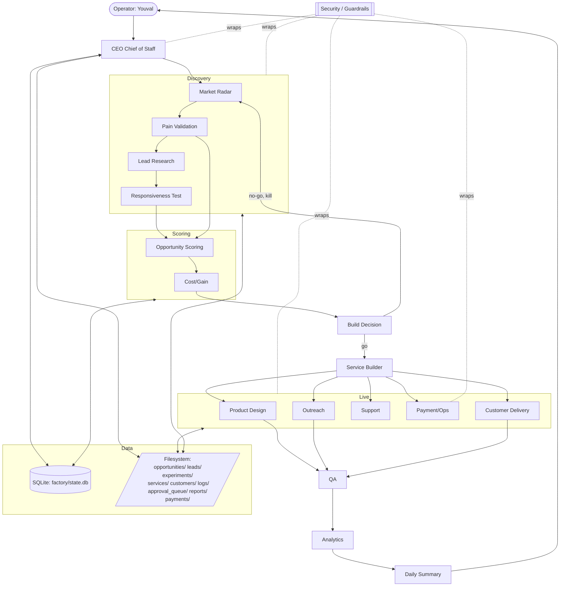
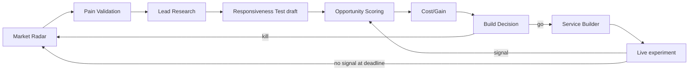

# Venture Factory — Architecture

Source of truth: this repo at `~/Documents/venture-factory`. Operator: Youval (Tel Aviv, IDT/UTC+3). End-of-month goal (June 2026): three live service experiments produced *by the factory*, not pre-picked.

---

## 1. Build approach: one-shot vs phased

**Phased**, four phases inside a single repo. One-shot is rejected because: (a) we need a tight feedback loop between the operator and the agents while policy is still maturing; (b) approval rules and cost ceilings have to be road-tested against real outreach before we widen autonomy; (c) the discovery loop must produce real signal before the build loop is worth wiring.

| Phase | Window | Definition of done |
|---|---|---|
| Phase 0 | Today, Sun May 31 2026 | Repo scaffold, `config/approval_policy.yaml`, `config/scoring_model.yaml`, `config/cost_gain_model.yaml`, `config/logs_format.yaml`, all 18 `factory/agents/<slug>/AGENT.md` stubs, `scripts/run_agent.py` MVP, smoke test green. |
| Phase 1 | Week 1 (Jun 1–7, W23) | Discovery loop live end-to-end: Market Radar -> Pain Validation -> Lead Research -> Opportunity Scoring -> Daily Summary. >=30 scored opportunities on disk. No outside-world actions yet. |
| Phase 2 | Week 2 (Jun 8–14, W24) | First experiment built by Service Builder from top-scored opportunity. Landing page drafted (unpublished). First Responsiveness Test draft batch in `approval_queue/`. |
| Phase 3 | Weeks 3–4 (Jun 15–30, W25–W26) | Three live experiments, each with a published landing page, an approved outreach round, and at least one responsiveness signal logged. Weekly kill/continue/scale call executed at least once. |

Phasing maps cleanly to the gates in section 11.

---

## 2. Recommended stack

| Layer | Choice | Why |
|---|---|---|
| Agent runner | Python 3.11 + `uv` | Fastest install, lockfile, one binary. We use a thin cron + script-runner pattern, not a framework. |
| Orchestration | `scripts/run_daily_loop.py` invoked by `cron` (macOS launchd acceptable) | Boring, observable, restartable. Zero hidden state. |
| LLM | Anthropic Claude API (primary). `litellm` shim for fallback to OpenAI / local. | Single API surface, swap cost is one config line. |
| State | SQLite at `factory/state.db` | Single-writer, file-backed, snapshottable via `git`. No server to run. |
| Data substrate | Markdown + YAML + JSON files in repo | Diff-able, grep-able, reviewable in PRs. Agents read and write the same files a human would. |
| Source of truth | GitHub (private) | Audit log, rollback, CI. |
| Landing pages | Cloudflare Pages | Free tier, instant deploy from `git push`, custom domains. |
| Outreach send | Resend (transactional) | Simple API, good deliverability for low volume. |
| Payments | Stripe | Payment Links cover Phase 3 without a checkout build. |
| Optional visual glue | n8n self-host (Docker on the same laptop) | Only if a non-Python integration becomes painful. Not required. |

**Trade-off vs LangChain / CrewAI / AutoGen.** Rejected. Heavy abstractions, opaque control flow, opinionated message shapes, and version churn. Our agents are stateless functions over files; a framework hides the one thing we need to inspect — the prompt and the IO.

**Trade-off vs all-Node.** Rejected. Python's data tooling (pandas, duckdb, sqlite stdlib, jsonschema) is more mature for a solo operator who will eyeball CSVs in the same session as running agents.

**Lock-in posture.** Agents communicate via files and JSON. The runner is ~200 lines. Swapping Python for Node, Claude for another model, SQLite for Postgres, or Cloudflare for Vercel is a half-day each. Nothing in this document forces the stack.

---

## 3. External services — four-tier classification

### Required NOW

| Service | Purpose | Setup complexity | Cost (USD/mo) | Risk | Safer alternative | Scope |
|---|---|---|---|---|---|---|
| Anthropic API | Primary LLM for all agents | Low (1 key) | 20–150 | Cost overrun if loops run hot | Per-day USD cap in `approval_policy.yaml`; litellm fallback | Internal-only |
| GitHub (private repo) | Source of truth, audit log | Low | 0 | Account loss | Local `git` + offsite backup | Internal-only |
| Cloudflare Pages | Host landing pages | Low | 0 | Vendor outage | Vercel, Netlify | Customer-facing |
| Domain registrar (Cloudflare Registrar or Namecheap) | Own the apex domain | Low | 1–2 per domain | Renewal lapse | Auto-renew on | Customer-facing |
| Resend (or Postmark) | Send outreach email | Low | 0–20 | Deliverability, sender reputation | Postmark; manual Gmail for first 10 sends | Customer-facing |
| Stripe | Payment links, invoicing | Medium (KYC) | 0 + fees | KYC delay | Lemon Squeezy, Paddle | Customer-facing |

Cap at six. Anything else waits.

### Useful SOON

| Service | Purpose | Setup complexity | Cost (USD/mo) | Risk | Safer alternative | Scope |
|---|---|---|---|---|---|---|
| Apollo or Hunter | Lead discovery / email enrichment | Medium | 0–50 | TOS limits on scraping | Manual LinkedIn + Clearbit Connect | Internal-only |
| Notion or Linear | Human-facing review surface for `approval_queue/` | Low | 0–10 | Yet another inbox | Markdown files + VS Code | Internal-only |
| Plausible or PostHog | Landing page analytics | Low | 0–9 | PII leakage if misconfigured | Cloudflare Web Analytics | Customer-facing |
| Make or n8n self-host | Visual glue for integrations the runner can't easily speak | Medium | 0–9 | Yet another runtime | Pure Python adapters | Internal-only |
| Twilio | Phone number, SMS for support | Medium | 1 + usage | Toll-fraud, A2P registration | Google Voice; skip SMS | Customer-facing |
| Calendly or Cal.com | Bookings if a service needs scheduling | Low | 0–12 | Lock-in | Cal.com self-host | Customer-facing |

### Optional LATER

| Service | Purpose | Notes |
|---|---|---|
| Algolia | Search across opportunities/experiments | SQLite FTS5 covers Phase 3. |
| Loom | Async demos for landing pages | Native screen capture works. |
| Replicate | Image generation for landing assets | Only if visuals become a bottleneck. |
| Zapier | Glue (vs n8n) | Pick one, not both. |
| Vercel | Hosting (vs Cloudflare) | Only if CF Pages limits hit. |
| Mixpanel | Product analytics | PostHog covers it. |

### AVOID for now

Salesforce, HubSpot Enterprise, Marketo, Segment, Snowflake, Databricks, any vendor with a six-figure-shaped contract pattern, anything that locks data behind a proprietary export, anything that requires a sales call to price.

---

## 4. Architecture



**Data flow in prose.** The CEO Chief of Staff is the only agent invoked directly by the operator's daily cron. Each downstream agent reads inputs from the filesystem (e.g. `opportunities/*.json`) and a small set of SQLite tables (runs, signals, costs), and writes outputs as new files plus state rows. Discovery agents produce `opportunities/<ulid>.json`; Scoring writes back `score`, `cost_gain`, and `decision` fields. Build Decision flips an opportunity into `experiments/<ulid>/` (a directory) where Service Builder writes the offer, landing copy, outreach drafts, and a `service.yaml`. Live agents read from that directory. QA reads any artifact about to leave the building and either signs off (writes `qa/passed.json`) or blocks. Analytics rolls metrics into `reports/daily/<YYYY-MM-DD>.json`. Daily Summary renders Markdown into `reports/daily/<YYYY-MM-DD>.md` and posts to the operator.

**Agent invocation.** Every agent lives in `factory/agents/<slug>/AGENT.md` (system prompt) with optional `factory/agents/<slug>/tools.py` (local helpers). They are invoked by `scripts/run_agent.py --agent <slug>`, which loads the AGENT.md, assembles inputs per a small `INPUTS` block in the AGENT.md frontmatter, calls Claude, writes outputs, and emits one structured log line per `config/logs_format.yaml`.

**Outside-world gate.** Anything touching the outside world (HTTP POST that mutates state, sending email, deploying a page, charging a card, creating an account) does not call the external API directly. It writes an approval request to `approval_queue/<ulid>.json` and exits 0. A human runs `scripts/approve.py <ulid>` or `scripts/reject.py <ulid>`. Approval causes the queued action to execute via `scripts/execute_action.py`. The factory never bypasses this on its own.

---

## 5. Agents

Schedule defaults are IDT. Log format reference: `config/logs_format.yaml`.

### 5.1 CEO Chief of Staff (`ceo_chief_of_staff`)

- **Purpose.** Orchestrates the daily loop, decides which downstream agents to run, surfaces pending decisions to the operator.
- **Inputs.** `reports/daily/<yesterday>.json`, `approval_queue/*.json`, `experiments/*/state.json`.
- **Outputs.** `logs/runs/<date>/ceo.jsonl`, `reports/daily/<today>.plan.json` (the day's intended agent sequence).
- **Tools.** Read filesystem, read SQLite, write plan file, invoke other agents via `scripts/run_agent.py`.
- **Permissions.** AUTO for everything internal. Cannot send anything external; cannot approve its own requests.
- **Schedule.** 05:55 IDT daily.
- **Alone.** Plan the day, reorder runs, pause an agent.
- **Approval.** None of its own. Surfaces others'.
- **Failure modes.** Plan file malformed -> daily loop falls back to default order from section 9.

### 5.2 Market Radar (`market_radar`)

- **Purpose.** Scan public sources (HN Who Is Hiring, IndieHackers, Reddit niche subs, Product Hunt launches, Twitter/X, Google Trends, niche newsletters) for opportunity signals.
- **Inputs.** `config/market_radar_sources.yaml`, last run's seen-set.
- **Outputs.** `opportunities/<ulid>.json` (status `candidate`), one per signal cluster.
- **Tools.** HTTP GET (read-only), HTML parsing, dedupe against SQLite `signals` table.
- **Permissions.** AUTO. Read-only web.
- **Schedule.** 06:00 IDT daily.
- **Alone.** Crawl, cluster, dedupe, write candidates.
- **Approval.** Only if a source requires auth credentials (creates an account request).
- **Failure modes.** Rate-limited source -> mark source `cooldown` for 24h.

### 5.3 Pain Validation (`pain_validation`)

- **Purpose.** Confirm a candidate opportunity reflects a real, paid-for pain (not a wish, not a meme).
- **Inputs.** Top N candidate opportunities from yesterday (default 10).
- **Outputs.** Updates opportunity JSON with `pain_score` (0–100), `evidence[]` (citations), `willingness_to_pay_signal` (yes/maybe/no), status `validated` or `rejected`.
- **Tools.** Web read, search, citation extraction.
- **Permissions.** AUTO.
- **Schedule.** 07:00 IDT daily.
- **Alone.** All scoring.
- **Approval.** None.
- **Failure modes.** Thin evidence -> `pain_score` capped at 30, opportunity flagged `weak_evidence`.

### 5.4 Lead Research (`lead_research`)

- **Purpose.** For each validated opportunity, find 20–50 reachable target customers with at least one usable contact channel.
- **Inputs.** `opportunities/*.json` where `status=validated`.
- **Outputs.** `leads/<opportunity_ulid>/<lead_ulid>.json`.
- **Tools.** Apollo/Hunter API (when configured), public web scraping (read-only).
- **Permissions.** AUTO for read. Spending Apollo credits beyond per-day USD cap requires approval.
- **Schedule.** 08:00 IDT daily.
- **Alone.** Discovery, enrichment, dedupe.
- **Approval.** Cost-cap exceedance; bulk export beyond 100 rows.
- **Failure modes.** No source available -> writes `leads/<op>/_blocked.md` with the gap.

### 5.5 Responsiveness Test (`responsiveness_test`)

- **Purpose.** Send a small, approved outreach batch and measure reply / click / book rate per opportunity.
- **Inputs.** Approved outreach drafts from Outreach agent; leads list.
- **Outputs.** `experiments/<ulid>/responsiveness/<batch>.json` (sent, opened, replied, booked, churned counts).
- **Tools.** Resend send API (gated), Plausible read, inbox poll.
- **Permissions.** REQUIRES APPROVAL for every send batch. AUTO for reading reply data.
- **Schedule.** Evening 20:00 IDT, only after approval.
- **Alone.** Compute metrics, write batch report.
- **Approval.** All sends.
- **Failure modes.** Send provider error -> retry once, then push back to approval queue with the error attached.

### 5.6 Opportunity Scoring (`opportunity_scoring`)

- **Purpose.** Score every opportunity against `config/scoring_model.yaml` weights (pain, addressable reach, willingness to pay, solo-operator fit, time-to-first-dollar).
- **Inputs.** All opportunities, latest scoring weights.
- **Outputs.** `score` field on each opportunity, `reports/scoring/<date>.json`.
- **Tools.** Read JSON, write JSON.
- **Permissions.** AUTO.
- **Schedule.** 09:30 IDT daily.
- **Alone.** All.
- **Approval.** None.
- **Failure modes.** Weights file missing -> falls back to equal weights and flags the run.

### 5.7 Cost/Gain (`cost_gain`)

- **Purpose.** Estimate cost-to-build and 30/90-day expected gain per `config/cost_gain_model.yaml`.
- **Inputs.** Scored opportunities; service template cost estimates.
- **Outputs.** `cost_estimate_usd`, `gain_estimate_usd_30d`, `gain_estimate_usd_90d`, `cg_ratio` on each opportunity.
- **Tools.** Read configs, do arithmetic, call LLM only for soft estimates.
- **Permissions.** AUTO.
- **Schedule.** 14:00 IDT daily.
- **Alone.** All.
- **Approval.** None.
- **Failure modes.** Missing model file -> opportunity flagged `unscored_cg`, excluded from Build Decision.

### 5.8 Build Decision (`build_decisions`)

- **Purpose.** Go / no-go gate. Picks which opportunities become experiments today.
- **Inputs.** Scored + cost/gain'd opportunities; current experiment slate; operator's per-week build budget.
- **Outputs.** Decision JSON per opportunity (`go` | `hold` | `kill`); on `go`, creates `experiments/<ulid>/decision.json`.
- **Tools.** Read JSON, write JSON.
- **Permissions.** AUTO to propose. Promoting to `build` requires operator approval if expected weekly spend exceeds cap.
- **Schedule.** 16:00 IDT daily (operator action window).
- **Alone.** Propose.
- **Approval.** Spend over cap; >1 new experiment per day.
- **Failure modes.** Tie at threshold -> defers to operator.

### 5.9 Service Builder (`service_builder`)

- **Purpose.** Instantiate a new service from `templates/service_template/` into `services/<slug>/` and link to `experiments/<ulid>/`.
- **Inputs.** `experiments/<ulid>/decision.json`, opportunity JSON.
- **Outputs.** `services/<slug>/service.yaml`, scaffolded landing page in `services/<slug>/landing/`, outreach draft folder, support stub.
- **Tools.** File templating, git commit (local only, no push).
- **Permissions.** AUTO for scaffold. Pushing to remote and deploying require approval.
- **Schedule.** Event-triggered on new `experiments/*/decision.json` with `go`.
- **Alone.** Scaffold.
- **Approval.** Publish, deploy, push.
- **Failure modes.** Template fields missing -> halts and writes `services/<slug>/_blocked.md`.

### 5.10 Product Design (`product_design`)

- **Purpose.** Write the offer, pricing, landing copy, onboarding flow.
- **Inputs.** Service folder, opportunity JSON, pain evidence.
- **Outputs.** `services/<slug>/offer.md`, `pricing.md`, `landing/index.md`, `onboarding.md`.
- **Tools.** LLM, read evidence, read brand voice (none yet — this is the factory, not Ziggy).
- **Permissions.** AUTO to draft.
- **Schedule.** Event-triggered after Service Builder.
- **Alone.** Drafts.
- **Approval.** Any pricing that implies a charge to a real customer requires approval before going on a landing page.
- **Failure modes.** Pricing model unclear -> writes `offer.md` with a `PRICING_TBD` block.

### 5.11 Outreach (`outreach`)

- **Purpose.** Draft and (with approval) send outreach.
- **Inputs.** Leads list, offer, pain framing.
- **Outputs.** `services/<slug>/outreach/<batch>/drafts/*.md`, send manifest, post-send report.
- **Tools.** LLM, Resend send (gated).
- **Permissions.** AUTO to draft. REQUIRES APPROVAL for every send.
- **Schedule.** Drafts after Lead Research finishes; sends 20:00 IDT after approval.
- **Alone.** Drafts, A/B variants, segmenting.
- **Approval.** All sends, all new sender domains.
- **Failure modes.** Draft fails brand/compliance lint -> drafts pushed back with comments, not queued for approval.

### 5.12 Support (`support`)

- **Purpose.** Handle inbound questions per `services/<slug>/support_policy.md`.
- **Inputs.** Incoming email / form replies stored in `support/inbox/`.
- **Outputs.** Drafted replies in `support/drafts/`, escalations in `approval_queue/`.
- **Tools.** LLM, search service docs.
- **Permissions.** AUTO to draft. Send to customer requires approval until trust threshold is set per service.
- **Schedule.** Event-triggered on new inbox file; sweep every 2h IDT during waking hours.
- **Alone.** Draft, classify, tag.
- **Approval.** All sends to real customers in Phase 2–3.
- **Failure modes.** Unclear intent -> tagged `needs_operator`.

### 5.13 Payment/Ops (`payment_ops`)

- **Purpose.** Billing, invoicing, Stripe payment link generation, refund prep.
- **Inputs.** Service pricing, customer state.
- **Outputs.** `payments/<service>/<customer>/intent.json`, generated payment link, ledger row.
- **Tools.** Stripe API (gated for any write), local ledger writes.
- **Permissions.** AUTO for reads and link generation in test mode. REQUIRES APPROVAL for live-mode link creation, charges, refunds.
- **Schedule.** Event-triggered.
- **Alone.** Test-mode links, ledger.
- **Approval.** Anything that moves real money.
- **Failure modes.** Stripe webhook delay -> ledger marks `pending_reconcile`.

### 5.14 Customer Delivery (`customer_delivery`)

- **Purpose.** Run the service for each paying customer (run the playbook in `services/<slug>/delivery.md`).
- **Inputs.** Customer record, service playbook.
- **Outputs.** `customers/<customer_id>/sessions/<ts>.md`, deliverables in `customers/<customer_id>/out/`.
- **Tools.** Whatever the playbook requires; LLM by default.
- **Permissions.** AUTO for internal work. Sending the deliverable to the customer requires approval in Phase 2–3.
- **Schedule.** Event-triggered on new customer or scheduled cadence per service.
- **Alone.** Execute the playbook, prepare deliverables.
- **Approval.** Customer-facing send.
- **Failure modes.** Playbook step undefined -> halts, writes blocker, pings CEO.

### 5.15 QA (`qa`)

- **Purpose.** Run `services/<slug>/qa_checklist.md` before anything ships.
- **Inputs.** Artifact being shipped (landing page, outreach batch, deliverable).
- **Outputs.** `qa/<artifact_id>/result.json` with pass/fail and findings.
- **Tools.** LLM, link checker, broken-image checker, spelling.
- **Permissions.** AUTO.
- **Schedule.** Event-triggered before any approval queue item involving customer-facing content.
- **Alone.** All checks.
- **Approval.** None (it is a gate, not an actor).
- **Failure modes.** Checklist missing -> defaults to a base checklist and flags the gap.

### 5.16 Analytics (`analytics`)

- **Purpose.** Instrument metrics, compute the funnel per service and per experiment.
- **Inputs.** Logs, ledger, responsiveness batch reports, Plausible / PostHog if configured.
- **Outputs.** `reports/daily/<date>.json`, `reports/weekly/<YYYY-WW>.json`, `dashboards/data/*.json`.
- **Tools.** SQLite queries, HTTP read.
- **Permissions.** AUTO.
- **Schedule.** 21:30 IDT.
- **Alone.** All.
- **Approval.** None.
- **Failure modes.** Missing source -> metric marked `n/a`.

### 5.17 Security / Guardrails (`security_guardrails`)

- **Purpose.** Enforce `config/approval_policy.yaml`, manage secrets, rate-limit external calls, scan outputs for PII leaks.
- **Inputs.** Every outgoing action proposal, every agent invocation, secrets vault.
- **Outputs.** Approval-queue items, denials in `logs/denied/<date>.jsonl`.
- **Tools.** Policy evaluator, regex/LLM PII scan, per-day USD counter.
- **Permissions.** Always-on. Can deny, cannot approve.
- **Schedule.** In-line on every agent run.
- **Alone.** Deny, throttle, redact.
- **Approval.** N/A.
- **Failure modes.** Policy file unparseable -> fails closed (block all external actions).

### 5.18 Daily Summary (`daily_summary`)

- **Purpose.** Assemble the daily report for the operator.
- **Inputs.** Analytics output, approval queue, experiment states, top decisions.
- **Outputs.** `reports/daily/<date>.md` plus a one-screen plaintext digest.
- **Tools.** LLM, templating.
- **Permissions.** AUTO.
- **Schedule.** 22:00 IDT.
- **Alone.** All.
- **Approval.** None.
- **Failure modes.** Missing inputs -> still publishes a partial report with gaps listed at the top.

---

## 6. Approval & autonomy rules

Policy lives in `config/approval_policy.yaml` (populated by parallel agent). Three rule classes.

### AUTO-ALLOWED

- Read the public web (GET, no auth, respect robots and rate limits).
- Write files inside this repo.
- Query own SQLite at `factory/state.db`.
- Draft (not send) any external content.
- Score, simulate, propose, schedule internal jobs.
- Generate test-mode Stripe payment links.
- Create local-only git commits (no push).

### REQUIRES APPROVAL (file appears in `approval_queue/<ulid>.json`, factory halts the action and waits)

- Publishing any landing page (deploy to Cloudflare Pages).
- Sending any outreach (email, SMS, DM).
- Any payment movement (charge, refund, payout) or live-mode link creation.
- Deploying to any public domain.
- Sending any message to a real customer.
- Spending money beyond the per-day USD cap (`limits.daily_spend_usd`, default 5).
- Calling any paid API beyond a configured per-day USD cap (`limits.daily_api_spend_usd`, default 10).
- Creating accounts on external services.
- Deleting anything (files, DB rows, remote resources).
- `git push` to remote.

### Approval JSON shape

```json
{
  "ulid": "01J0E8...",
  "action_type": "outreach.send_batch",
  "summary": "Send 20 outreach emails for experiment 01J0E8...",
  "agent": "outreach",
  "payload": {
    "service": "<slug>",
    "batch": "001",
    "recipients_count": 20,
    "preview_drafts": ["services/<slug>/outreach/001/drafts/lead_0001.md"]
  },
  "cost_estimate_usd": 0.12,
  "risk": "medium",
  "qa_result_ref": "qa/<artifact_id>/result.json",
  "created_at": "2026-06-10T17:00:00+03:00",
  "expires_at": "2026-06-11T17:00:00+03:00"
}
```

Operator approves with `scripts/approve.py <ulid>` (writes `approval_queue/<ulid>.approved.json`), rejects with `scripts/reject.py <ulid> --reason "..."`. Expired requests are auto-rejected by `security_guardrails` on the next sweep.

---

## 7. Data model and repo structure

```
venture-factory/
  .git/
  .gitignore
  README.md
  docs/
    ARCHITECTURE.md            # this file
  config/
    approval_policy.yaml
    scoring_model.yaml
    cost_gain_model.yaml
    logs_format.yaml
    market_radar_sources.yaml
    secrets.example.env
  factory/
    state.db                   # SQLite (gitignored)
    agents/
      ceo_chief_of_staff/AGENT.md
      market_radar/AGENT.md
      pain_validation/AGENT.md
      lead_research/AGENT.md
      responsiveness_test/AGENT.md
      opportunity_scoring/AGENT.md
      cost_gain/AGENT.md
      build_decisions/AGENT.md
      service_builder/AGENT.md
      product_design/AGENT.md
      outreach/AGENT.md
      support/AGENT.md
      payment_ops/AGENT.md
      customer_delivery/AGENT.md
      qa/AGENT.md
      analytics/AGENT.md
      security_guardrails/AGENT.md
      daily_summary/AGENT.md
  templates/
    opportunity.schema.json
    lead_source.schema.json
    experiment.schema.json
    service_template/
      service.yaml
      offer.md
      pricing.md
      landing/index.md
      onboarding.md
      delivery.md
      support_policy.md
      qa_checklist.md
  opportunities/                # <ulid>.json
  leads/                        # <opportunity_ulid>/<lead_ulid>.json
  experiments/                  # <ulid>/{decision.json, state.json, responsiveness/}
  services/                     # <slug>/...
  customers/                    # <customer_id>/...
  payments/                     # <service>/<customer>/...
  support/                      # inbox/, drafts/
  approval_queue/               # <ulid>.json, <ulid>.approved.json
  logs/                         # runs/<date>/<agent>.jsonl, denied/<date>.jsonl
  reports/
    daily/                      # <date>.{json,md}
    weekly/                     # <YYYY-WW>.{json,md}
    scoring/                    # <date>.json
  dashboards/                   # html + data/
  security/                     # policy snapshots, audit
  prompts/                      # reusable prompt fragments
  scripts/
    run_agent.py
    run_daily_loop.py
    approve.py
    reject.py
    execute_action.py
    smoke_test.py
  pyproject.toml
  uv.lock
```

### Opportunity (`templates/opportunity.schema.json`)

```json
{
  "$schema": "https://json-schema.org/draft/2020-12/schema",
  "title": "Opportunity",
  "type": "object",
  "required": ["ulid", "title", "source", "status", "created_at"],
  "properties": {
    "ulid": {"type": "string"},
    "title": {"type": "string", "maxLength": 140},
    "summary": {"type": "string"},
    "source": {"type": "object", "required": ["type", "url"], "properties": {
      "type": {"enum": ["hn", "reddit", "ph", "newsletter", "x", "trends", "other"]},
      "url": {"type": "string", "format": "uri"},
      "captured_at": {"type": "string", "format": "date-time"}
    }},
    "tags": {"type": "array", "items": {"type": "string"}},
    "pain_score": {"type": "integer", "minimum": 0, "maximum": 100},
    "evidence": {"type": "array", "items": {"type": "object", "required": ["url", "quote"], "properties": {
      "url": {"type": "string", "format": "uri"},
      "quote": {"type": "string"}
    }}},
    "willingness_to_pay_signal": {"enum": ["yes", "maybe", "no", "unknown"]},
    "score": {"type": "number"},
    "cost_estimate_usd": {"type": "number"},
    "gain_estimate_usd_30d": {"type": "number"},
    "gain_estimate_usd_90d": {"type": "number"},
    "cg_ratio": {"type": "number"},
    "status": {"enum": ["candidate", "validated", "rejected", "scored", "go", "hold", "kill", "building", "live", "archived"]},
    "decision_log": {"type": "array", "items": {"type": "object"}},
    "created_at": {"type": "string", "format": "date-time"},
    "updated_at": {"type": "string", "format": "date-time"}
  }
}
```

### LeadSource (`templates/lead_source.schema.json`)

```json
{
  "$schema": "https://json-schema.org/draft/2020-12/schema",
  "title": "LeadSource",
  "type": "object",
  "required": ["ulid", "opportunity_ulid", "channel", "identifier", "discovered_at"],
  "properties": {
    "ulid": {"type": "string"},
    "opportunity_ulid": {"type": "string"},
    "name": {"type": "string"},
    "company": {"type": "string"},
    "role": {"type": "string"},
    "channel": {"enum": ["email", "linkedin", "x", "phone", "form", "other"]},
    "identifier": {"type": "string"},
    "source": {"type": "string"},
    "enrichment": {"type": "object"},
    "consent_basis": {"enum": ["legitimate_interest", "opt_in", "unknown"]},
    "suppression": {"type": "boolean", "default": false},
    "discovered_at": {"type": "string", "format": "date-time"}
  }
}
```

### Experiment (`templates/experiment.schema.json`)

```json
{
  "$schema": "https://json-schema.org/draft/2020-12/schema",
  "title": "Experiment",
  "type": "object",
  "required": ["ulid", "opportunity_ulid", "service_slug", "status", "started_at"],
  "properties": {
    "ulid": {"type": "string"},
    "opportunity_ulid": {"type": "string"},
    "service_slug": {"type": "string"},
    "hypothesis": {"type": "string"},
    "kill_criteria": {"type": "object", "properties": {
      "no_signal_days": {"type": "integer", "default": 7},
      "min_reply_rate": {"type": "number", "default": 0.02},
      "min_cg_ratio": {"type": "number", "default": 1.5}
    }},
    "metrics": {"type": "object", "properties": {
      "sent": {"type": "integer"},
      "opened": {"type": "integer"},
      "replied": {"type": "integer"},
      "booked": {"type": "integer"},
      "paid": {"type": "integer"},
      "revenue_usd": {"type": "number"}
    }},
    "status": {"enum": ["scaffolded", "drafted", "approved", "live", "paused", "killed", "scaled"]},
    "started_at": {"type": "string", "format": "date-time"},
    "decision_log": {"type": "array", "items": {"type": "object"}}
  }
}
```

---

## 8. The market -> pain -> lead -> test -> cost/gain -> decision -> build loop



Numbered runbook (agent owner in brackets):

1. **Scan.** Pull from configured sources, cluster signals, write candidate opportunities. *(market_radar)*
2. **Validate pain.** Confirm pain is real and paid for; attach evidence. *(pain_validation)*
3. **Find leads.** Build a 20–50 person target list per validated opportunity. *(lead_research)*
4. **Draft + approve outreach; send small batch.** Measure replies / clicks / books. *(responsiveness_test with outreach drafts and operator approval)*
5. **Score.** Weighted score per `scoring_model.yaml`. *(opportunity_scoring)*
6. **Estimate cost/gain.** Per `cost_gain_model.yaml`. *(cost_gain)*
7. **Decide.** Go / hold / kill. On go, instantiate experiment. *(build_decisions -> service_builder)*

The loop runs every day; an opportunity can cycle through it multiple times as evidence accrues.

---

## 9. Daily operating loop

All times IDT.

| Time | Agent | Action |
|---|---|---|
| 05:55 | ceo_chief_of_staff | Build today's plan, read approval queue, surface blockers |
| 06:00 | market_radar | Scan sources, write candidate opportunities |
| 07:00 | pain_validation | Validate top 10 candidates from yesterday |
| 08:00 | lead_research | Build lead lists for validated opportunities |
| 09:30 | opportunity_scoring | Score everything |
| 10:00 | daily_summary (interim) | Deliver morning brief to operator |
| 14:00 | cost_gain | Rerun cost/gain with latest data |
| 16:00 | build_decisions | Propose go/hold/kill; operator action window |
| 17:00 | service_builder | Scaffold any newly approved experiments |
| 17:30 | product_design + outreach (draft) | Drafts only |
| 19:00 | qa | Gate any artifacts queued for approval |
| 20:00 | responsiveness_test / outreach (send) | Only if approved during the day |
| 21:30 | analytics | Compute funnel, write report JSON |
| 22:00 | daily_summary | Final report to operator |
| 22:15 | (logs roll-up) | `scripts/run_daily_loop.py` rotates `logs/runs/<date>/` |

### Shabbat / Friday handling

From **Friday 18:00 IDT through Saturday 20:00 IDT** the factory runs in **read-only mode**:

- `market_radar`, `analytics`, `daily_summary` may run.
- `outreach`, `responsiveness_test`, `payment_ops` live actions, `customer_delivery` customer-facing sends, and any `git push` are blocked at the `security_guardrails` layer.
- Approvals queued during this window simply wait. No backdated sends.
- Saturday 20:00 IDT, `ceo_chief_of_staff` runs a catch-up pass.

---

## 10. Weekly kill/continue/scale loop

Sunday 09:00 IDT. Each active experiment is evaluated.

| Rule | Condition | Outcome |
|---|---|---|
| KILL | No responsiveness signal in 7 days (reply rate < `kill_criteria.min_reply_rate`) **OR** `cg_ratio` < `cost_gain_model.thresholds.min_cg_ratio` for 2 consecutive evals | `status=killed`, opportunity returns to `market_radar` seen-set with `kill_reason` tag |
| CONTINUE | Early signal present but below scale bar (e.g. reply > min but no booked customer) | `status=live`, no slate change |
| SCALE | Reply rate above scale threshold **AND** at least one paid customer in pipeline | Increase outreach volume cap, allocate a second batch, optionally cut a duplicate experiment to free capacity |

Output: `reports/weekly/<YYYY-WW>.md` (rendered from `<YYYY-WW>.json`), summarising the slate, the rule each experiment hit, the action taken, and any opportunities promoted back from the kill pile.

---

## 11. End-of-month plan to reach 3 live service experiments

Today: Sun May 31 2026. Target: 3 live experiments by Tue Jun 30 2026. Each milestone has an explicit gate; the day after the gate is the buffer to recover.

| Week | Dates (IDT) | Milestone | Gate (must be true to proceed) |
|---|---|---|---|
| **W23** | Jun 1 – Jun 7 | Discovery loop online | `>=30` opportunities written to `opportunities/` with `score` set; `daily_summary` delivered every day; zero outside-world sends |
| **W24** | Jun 8 – Jun 14 | Top 5 validated, top 3 selected, services scaffolded, landing pages drafted | 3 `experiments/<ulid>/` exist with `status=drafted`; 3 `services/<slug>/landing/index.md` exist; QA passes on all three drafts |
| **W25** | Jun 15 – Jun 21 | Approval cycle, landing pages published, outreach round 1 sent | All 3 landing pages live on their CF Pages URLs; outreach batch 001 sent for each (post-approval); first reply data trickling in |
| **W26** | Jun 22 – Jun 28 | Responsiveness data in; weekly kill/continue/scale call run; all 3 experiments officially live with >=1 signal each (or replaced from the pipeline) | `reports/weekly/2026-W26.md` shows 3 live experiments each with >=1 signal in {opened, replied, booked, paid} |
| **buffer** | Jun 29 – Jun 30 | Final `daily_summary` for Jun 30 confirms 3 live experiments | Operator signs off in `reports/daily/2026-06-30.md` |

The factory selects the three. The operator approves gates, not picks.

---

## 12. Prompt chain across surfaces

Surfaces: **Claude web** (planning, this doc), **Claude Code CLI** (build / refactor in the repo), **agent runner** (Python invoking Claude API per AGENT.md), **browser-or-manual** (operator action: approve, deploy, click "send" inside an external dashboard if needed).

| # | Step | Surface | Prompt template (path or sketch) | Expected output | Who approves |
|---|---|---|---|---|---|
| 1 | Scaffold the factory | Claude Code CLI | Verbatim block in section 13 | Repo populated, smoke test green | Operator |
| 2 | Generate an Opportunity row | Agent runner | `factory/agents/market_radar/AGENT.md` + `prompts/opportunity_from_signal.md` | New `opportunities/<ulid>.json` validating against schema | Auto |
| 3 | Validate pain | Agent runner | `factory/agents/pain_validation/AGENT.md` | Opportunity updated with `pain_score`, `evidence[]`, `status` | Auto |
| 4 | Score the opportunity | Agent runner | `factory/agents/opportunity_scoring/AGENT.md` with `config/scoring_model.yaml` | `score` field on opportunity; `reports/scoring/<date>.json` row | Auto |
| 5 | Draft outreach copy | Agent runner | `factory/agents/outreach/AGENT.md` + `prompts/outreach_draft.md` | `services/<slug>/outreach/<batch>/drafts/*.md` | Auto (draft only) |
| 6 | Operator approves outreach | Browser-or-manual | `scripts/approve.py <ulid>` after reading the approval JSON | `approval_queue/<ulid>.approved.json` | Operator |
| 7 | Send outreach | Agent runner | `scripts/execute_action.py <ulid>` -> Resend API | Send manifest, `responsiveness/<batch>.json` initialised | Already approved at step 6 |
| 8 | Ingest reply data | Agent runner | `factory/agents/responsiveness_test/AGENT.md` | `responsiveness/<batch>.json` counters updated | Auto |
| 9 | Score responsiveness | Agent runner | Reuses `opportunity_scoring` with responsiveness inputs | Updated `score` on experiment | Auto |
| 10 | Decide kill / continue / scale | Agent runner (weekly) | `factory/agents/build_decisions/AGENT.md` in weekly mode | `reports/weekly/<YYYY-WW>.json` and `.md` | Operator confirms on scale or kill of paid experiment |
| 11 | Generate the daily summary | Agent runner | `factory/agents/daily_summary/AGENT.md` | `reports/daily/<date>.md` plus digest | Auto |
| 12 | Deploy a landing page | Operator action + agent runner | Approval payload includes built artifact; `execute_action.py` runs `wrangler pages deploy` | Live URL written back to `services/<slug>/service.yaml` | Operator |

---

## 13. The exact first Claude Code prompt

Paste the block below verbatim into Claude Code from inside `~/Documents/venture-factory`.

```text
You are Claude Code. Working directory: ~/Documents/venture-factory. The repo scaffold already exists (config/, factory/agents/, templates/, scripts/, approval_queue/, logs/, opportunities/, leads/, experiments/, services/, customers/, payments/, support/, reports/, dashboards/, security/, prompts/, docs/). Read docs/ARCHITECTURE.md before doing anything else and treat it as the spec.

Goal: build the Python agent runner MVP for the Venture Factory. Stay minimal. No frameworks. Boring code wins.

Tasks, in order:

1. Set up the Python project with uv (Python 3.11). Create pyproject.toml with dependencies: anthropic, jsonschema, pyyaml, python-ulid, httpx, python-dotenv. Generate uv.lock. Add .python-version pinned to 3.11.

2. Implement scripts/run_agent.py with this contract:
   - CLI: `run_agent.py --agent <slug> [--input <path>] [--dry-run]`.
   - Loads factory/agents/<slug>/AGENT.md as the system prompt.
   - Loads config/approval_policy.yaml and config/logs_format.yaml at startup.
   - Reads inputs declared in the AGENT.md frontmatter (a YAML block at the top between --- markers, with keys: inputs (list of globs), outputs (list of paths or path templates), schedule, permissions).
   - Calls the Anthropic Claude API (model: claude-opus-4-5 or the latest available; read ANTHROPIC_API_KEY from .env). Use the messages API. Stream optional.
   - Parses the model output. If the output contains an action block of the form ```action ... ``` (a YAML or JSON block describing an outside-world action), do not execute it. Instead write approval_queue/<ulid>.json conforming to the shape in section 6 of ARCHITECTURE.md. Print the ulid.
   - For any file write the model proposes inside the repo (and only the repo), perform the write directly. Reject writes outside the repo root.
   - Emit exactly one structured log line per run to logs/runs/<YYYY-MM-DD>/<agent>.jsonl following config/logs_format.yaml (run_id, agent, started_at, ended_at, status, tokens_in, tokens_out, cost_usd_estimate, outputs[], approval_requests[], errors[]).
   - Enforce per-day USD caps from approval_policy.yaml using a small counter persisted in factory/state.db (table: spend_ledger).

3. Implement scripts/run_daily_loop.py that invokes agents in the order from section 9 of ARCHITECTURE.md, skipping any agent whose preconditions are not met (log a SKIP). Respect Friday 18:00 IDT to Saturday 20:00 IDT read-only window (block agents whose permissions include external send).

4. Implement scripts/approve.py and scripts/reject.py:
   - approve.py <ulid>: validate the approval JSON, write approval_queue/<ulid>.approved.json with operator_ts, then invoke scripts/execute_action.py <ulid>.
   - reject.py <ulid> --reason "<text>": write approval_queue/<ulid>.rejected.json, append to logs/denied/<date>.jsonl.

5. Implement scripts/execute_action.py as a dispatcher keyed on action_type. For Phase 0, stub every action_type to write a `simulated_execution.json` next to the approved file and log it. Real adapters (Resend, Stripe, wrangler) come later — leave a TODO and a clear extension point.

6. Initialise factory/state.db with sqlite3 stdlib. Tables: runs, signals, spend_ledger, experiments. Migrations live in scripts/migrations/ as numbered .sql files. Apply on first run.

7. Add scripts/smoke_test.py:
   - Runs `run_agent.py --agent market_radar --dry-run` against a fixture source list (config/fixtures/market_radar_fixture.json).
   - Asserts at least one opportunities/<ulid>.json is written and validates against templates/opportunity.schema.json.
   - Asserts one log line exists.
   - Exits non-zero on any failure.

8. Wire `uv run smoke` via a pyproject.toml [tool.uv] scripts entry (or a Makefile target if simpler).

Constraints:
- No outside-world calls during Phase 0 unless behind the approval queue.
- All file paths inside the repo. Reject anything else.
- Reads ANTHROPIC_API_KEY from .env via python-dotenv. Never log the key.
- If config/approval_policy.yaml is missing or unparseable, fail closed: block every external action and exit 1.

Deliverable: a green `uv run smoke` and a one-paragraph CHANGES.md entry summarising what you built and any deviations from this prompt.
```

---

## 14. Reminder: do not pre-pick the 3 services

The factory discovers the three live experiments. No service is selected in advance by the operator or by this document. Market Radar scans, Pain Validation filters, Lead Research and Responsiveness Test surface real-world signal, Opportunity Scoring and Cost/Gain rank, Build Decision picks. **Any service named anywhere in this document is EXAMPLE ONLY.** If a name slips in elsewhere in the repo without that tag, treat it as a bug and remove it.

---

## 15. Examples are labeled

Every illustrative example in this document carries an "EXAMPLE ONLY" tag where it appears. Default schedule times are defaults, not examples. Default config thresholds (per-day spend cap 5 USD, reply rate 2%, cg_ratio 1.5) are defaults, not examples — the operator changes them in `config/`. Anything that names a hypothetical service, vertical, persona, or customer is EXAMPLE ONLY and must not be read as a recommendation or a pre-pick.
